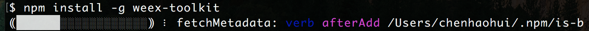
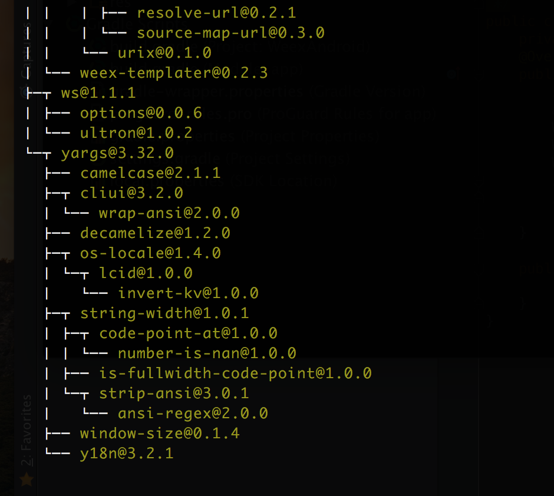
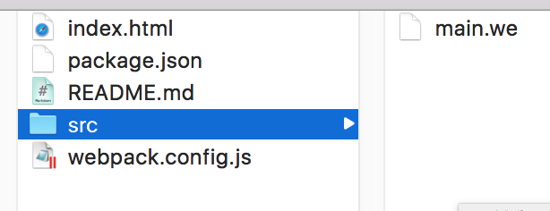
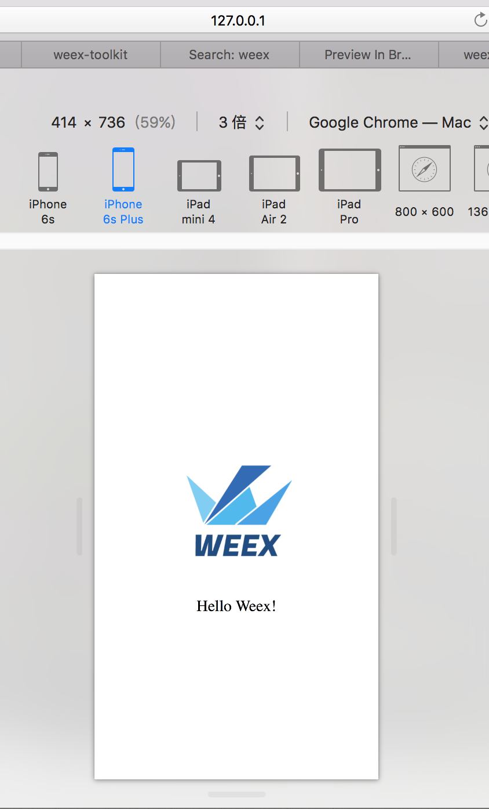
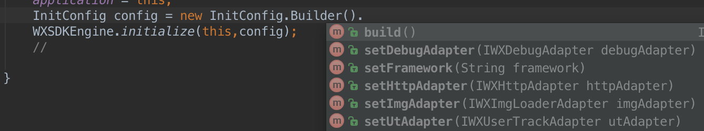

# Weex入门教程（Android版）中文版
--
巴拉一波：

前几天参加一个项目活动，我们的小组使用了weex来做客户端开发。几天用下来感觉入门成本不高（想玩好还是需要多研究下的）。由于本人是Android开发小白，于是就写了这篇`Android入坑weex入门教程`。

其实前半部分都是通用，后面一部分涉及到Android客户端使用weex的入门细节，IOS同学可以参考前面部分。

先提供几个阿里weex官方网址：

- weex github:<https://github.com/alibaba/weex>

--

**请跟随我入坑的脚步，文档主要分为3个部分：**

1. 环境搭建
2. weex基本语法
3. weex进阶

适用人群：`Android开发者想快速入门weex`。

##1. 环境搭建
`主要分2个部分：weex环境搭建+Android项目搭建`

###weex环境搭建
> 注释一波：`weex`需要在`Node.js4.0+`环境支持，因此需要先装`Node.js`。

##### 1.安装`Node.js`(这里使用[homebrew](http://www.cnblogs.com/lzrabbit/p/4032515.html)来安装):
###### 安装brew：
```
ruby -e "$(curl -fsSL https://raw.githubusercontent.com/Homebrew/install/master/install)"
```
###### 通过`brew`安装`Node.js`：
```
brew install nvm
```
成功后如果直接执行`nvm --version`会得到`zsh: command not found: nvm`，可以刚才`install`后续有一段文字：

```
You should create NVM's working directory if it doesn't exist:

  mkdir ~/.nvm

Add the following to ~/.zshrc or your desired shell
configuration file:

  export NVM_DIR="$HOME/.nvm"
  . "$(brew --prefix nvm)/nvm.sh"

You can set $NVM_DIR to any location, but leaving it unchanged from
/usr/local/Cellar/nvm/0.31.2 will destroy any nvm-installed Node installations
upon upgrade/reinstall.

Type `nvm help` for further information.
```
我们按照上述操作，将：
`export NVM_DIR="$HOME/.nvm"
  . "$(brew --prefix nvm)/nvm.sh"`
放入`~/.zshrc`中，执行：

```
srouce ~/.zshrc
```
这时`Node.js`装好了，输入`nvm --version`一看版本：`0.31.2`,版本太老了。还需要**升级**，我们使用`nvm`进行升级。

执行`nvm ls-remote`会打印所有的`nvm`版本，我们选择一个最新的：`v6.3.1`(此处可能不同)

```
nvm install v6.3.1
```
等待命令完成，`Node.js`环境完成。

##### 2.安装 [weex Toolkit](https://www.npmjs.com/package/weex-toolkit) (Preview功能，可以直接在chrome中浏览)
```
npm install -g weex-toolkit
```

> 国内这个命令要等待很久，想要加速的同学可以vpn或者使用镜像。

成功了会出现如下树结构则是成功。


####怎么使用？
我们先创建一个空目录，在终端切换到该目录，执行:`weex init`。几秒后会创建如下结构：


可以看到`src`目录中有一个`main.we`，这就是我们可以编辑的主要文件。

接下来在`src`目录下执行:`weex main.we`,会自动弹出浏览器，调整到响应模式，就可以看到移动页面上的效果。



> 这个页面支持`hot-reload`,因此我们可以很方便的进行`即时预览`。

--

这样我们h5上环境已经打通了，我们是个android开发者，当然希望能用安卓App来看效果。

**weex已经提供了可以扫码进行预览的App** 下载地址是<http://alibaba.github.io/weex/download.html> 


扫码信息可以使用：
```
weex --qr main.we
```


--


##当然，这样还不够满足
只能通过官方App来查看，我们要在自己的App里面掌控一切！所以，接着看，来自己搭一个App吧！

在这之前，我们需要了解一下`weex`的大致原理。`这里容笔者yy一番`

1. 在weex中，我们通过编写`.we`文件，交由weex引擎进行`翻译`，转化成`.js`文件，也就是`JS Bundle`。
2. 每个`JS Bundle`可以用于服务的支持，当客户端进行服务请求时，会获取这个翻译好的`.js`文件。
3. 客户端通过一系列转化{`JSCore/v8`},通过`Js-Native Bridge`使得js与Native进行交互，通过协议进行`callNative`\`callJs`等操作。

--
因此，需要做4件事：

1. 编写:`.we`
2. 翻译:`.we` - > `.js`
3. 启服务: 使`.js`能够被客户端获取
4. js-Native交互能力

逐步分析：

- `1` 需要开发者自动编写；
- `2`、`3` weex 通过`gulp`自动化构建工具 [好奇点这里](http://www.gulpjs.com.cn) 
-  `4` 需要 Andrioid App引入weex支持。


###装一发gulp解决2、3

以全局方式安装gulp

```
npm install -g gulp
```
安装好后切换到刚才执行`weex init`那个目录下。执行：
(这里最好使用`sudo`权限)

```
npm install gulp
```


###weex Android项目搭建
这里可以参考weex官方文档:<http://alibaba.github.io/weex/doc/advanced/integrate-to-android.html>。其中`Prepare your app`一节中已经对如何建立进行了描述(但是如果你看懂了就不会来找文章了)。

--

或者下载文档同目录下的`WeexAndroid`项目，是本人测试通过的一个demo项目。

--
**或是跟着笔者来一起创建这个项目：**

1. 使用Android Studio建一个空项目。
2. `build.gradle`引入weex sdk以及相关依赖:
3. 
```
compile 'com.android.support:recyclerview-v7:23.1.1'
compile 'com.android.support:support-v4:23.1.1'
compile 'com.android.support:appcompat-v7:23.4.0'
compile 'com.alibaba:fastjson:1.1.45'
compile 'com.taobao.android:weex_sdk:+'
```

3. `manifests`加入网络请求权限：`<uses-permission android:name="android.permission.INTERNET" />`
4. 创建`WXApplication`,并且在`manifests`指定`Application name`:`android:name=".WXApplication"`：

```
public class WXApplication extends Application {
    private static WXApplication application;
    public static synchronized WXApplication getInstance(){
        
        return application;
    
    }
    @Override
    public void onCreate() {
        super.onCreate();
        application = this;
        InitConfig config = new InitConfig.Builder().build();
        WXSDKEngine.initialize(this,config);
    }

}
```
从`InitConfig `中可以自定义实现一些weex提供的`adapter`,像`图片加载、debug、网络请求、埋点`等。


6. 创建`MainActivity`,将weex引擎添加到ui中，并且使`WXSDKInstance`代理Activity生命周期


```
public class MainActivity extends AppCompatActivity {

    private WXSDKInstance wxsdkInstance;
    private final String JsPath = "";

    @Override
    protected void onCreate(Bundle savedInstanceState) {
        super.onCreate(savedInstanceState);
        setContentView(R.layout.activity_main);

        wxsdkInstance = new WXSDKInstance(this);
        wxsdkInstance.registerRenderListener(new RenderListener());

        wxsdkInstance.renderByUrl("index","JsPath",null,null,-1,-1, WXRenderStrategy.APPEND_ASYNC);
    }

    @Override
    protected void onResume() {
        super.onResume();
        if (null != wxsdkInstance){
            wxsdkInstance.onActivityResume();
        }
    }

    @Override
    protected void onPause() {
        super.onPause();
        if (null != wxsdkInstance){
            wxsdkInstance.onActivityPause();
        }
    }

    @Override
    protected void onDestroy() {
        super.onDestroy();
        if (null != wxsdkInstance){
            wxsdkInstance.onActivityDestroy();
        }
    }

    @Override
    protected void onStart() {
        super.onStart();
        if (null != wxsdkInstance){
            wxsdkInstance.onActivityStart();
        }
    }

    @Override
    protected void onStop() {
        super.onStop();
        if (null != wxsdkInstance){
            wxsdkInstance.onActivityStop();
        }
    }

    class RenderListener implements IWXRenderListener{
        @Override
        public void onViewCreated(WXSDKInstance instance, View view) {
            //添加到视图中
            ((FrameLayout)MainActivity.this.findViewById(R.id.root)).addView(view);
        }

        @Override
        public void onRenderSuccess(WXSDKInstance instance, int width, int height) {

        }

        @Override
        public void onRefreshSuccess(WXSDKInstance instance, int width, int height) {

        }

        @Override
        public void onException(WXSDKInstance instance, String errCode, String msg) {

        }
    }
}
```

8. 修改`MainActivity`中的`JsPath`指向生成的JS文件，启动App就可以看到效果。


